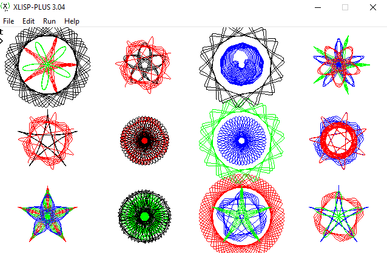

# Práctica 1: Lenguajes de programación

## Ejemplo

### Part 1 (3 punts):

- [x] (guarda-informacio)
- [x] (vermell)
- [x] (blau)
- [x] (verd)
- [x] (negre)
- [x] (cercle x y radi n)
- [x] (radigran r)
- [x] (radipetit r)
- [x] (punt p), (inici angle), (escala e), (posicio x y)
- [x] (reduir m n)

### Part 2 (4 punts):

- [x] (spirograph p gran petit t inc inici)
- [x] (spiro gran petit p inc inici)

### Part 3 (3 punts):

- [x] (roda)
- [x] (roda-voltes n)
- [x] (spiro-voltes voltes gran petit p in inici)
- [x] (spiros l)
- [x] (dibuix)
